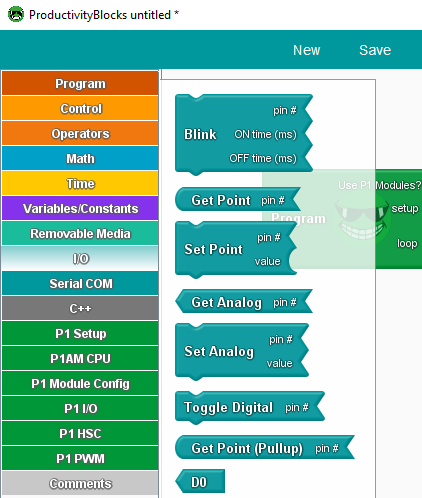
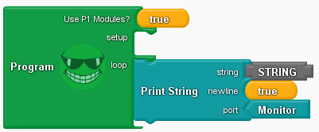
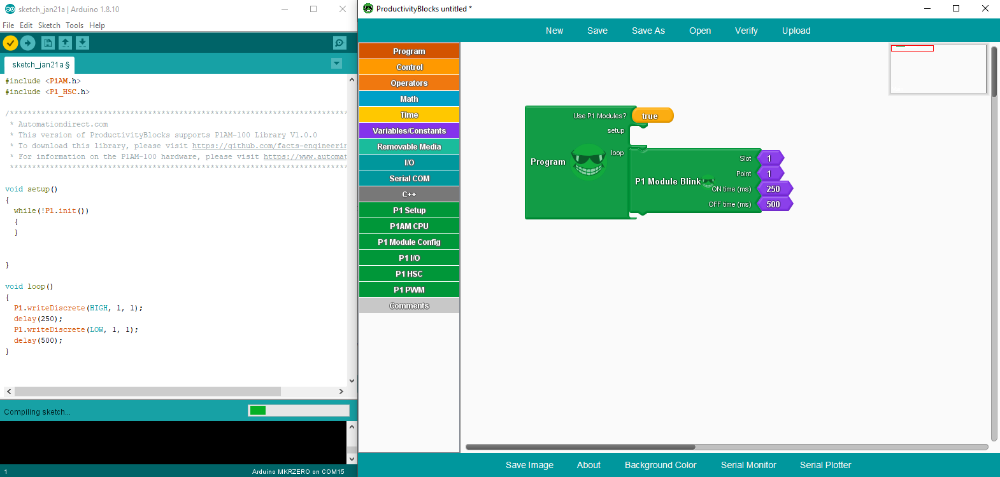

#ProductivityBlocks

ProductivityBlocks is an open source block programming tool for the [Arduino Editor](http://www.arduino.cc/en/Main/Software). The application is designed to work with the [P1AM-100 library](https://github.com/facts-engineering/P1AM) to program a P1AM CPU. 

##Installation
Before installing ProductivityBlocks, please install the [Arduino Editor](https://www.arduino.cc/en/Main/Software).
ProductivityBlocks is a tool for the Arduino software, and will not work properly unless the Arduino software is installed.

###Windows:

1. Download the latest ProductivityBlocks installer for Windows from the [Releases](https://github.com/adcpblocks/ProductivityBlocks/releases).
2. Close any Arduino Editor windows.

    

3. Run the installer as an administrator.

    
3. Open/reopen the Arduino Editor and check for ProductivityBlocks in the tools menu.

    

#Getting Started

ProductivityBlocks is a graphical block programming tool that writes c++ code to the Arduino software. 

Each block represents a piece of a program that will run on Arduino CPUs.
To create a program, use the tabs on the left side of the application to select a block category: 

Then click and drag the desired block into the main canvas: 

Blocks snap into place when dragged close enough to a connector with the right shape.

Once a block program has been created, click the 'Verify' button to check the generated c++ code:

When the program is ready, use the 'Upload' button to push the program to a connected Arduino board.

#Basic Block Programming

Each block represents a piece of a full program. There a few special blocks that represent the full c++ program:

**Loop**

**Program**

**P1 Program**

